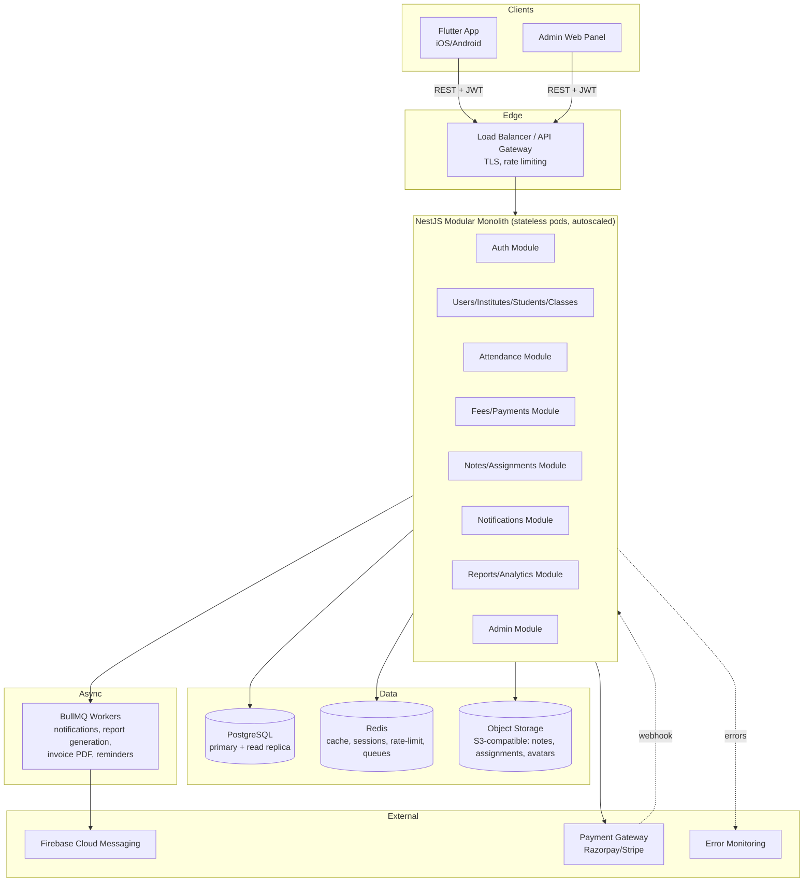

# 2. System Architecture

## 2.1 Style: modular monolith, not microservices — for now

Given the domain (single coherent write-heavy transactional system: attendance, fees, enrollments, all deeply cross-referenced) and the realistic initial scale (thousands, not tens of millions, of concurrent users at launch), a **modular monolith** is the right call:

- One NestJS deployable, internally split into strict feature **modules** (`auth`, `users`, `institutes`, `students`, `classes`, `attendance`, `fees`, `notes`, `assignments`, `notifications`, `calendar`, `reports`, `admin`) that only talk to each other through exported services — never reach into another module's repository directly.
- One PostgreSQL database, schema-per-concern via table prefixing + FK constraints (real relational integrity is exactly what fee/attendance/enrollment coupling needs — this is why Postgres over Firestore).
- This gets 90% of microservices' maintainability (clear boundaries, independent testing) without the operational cost (service mesh, distributed transactions, N deployments) — and the module boundaries are exactly where you'd cut microservices out later *if* a specific module (e.g., notifications, reporting) needs independent scaling.

**Explicit non-goal at launch**: microservices, GraphQL federation, multi-region active-active. These are premature for the stated scale and would slow down the MVP for no present benefit. The architecture below keeps the door open (stateless API pods, externalized session/cache, queue-based background work) without paying the cost now.

## 2.2 High-level component diagram

## 2.3 Multi-tenancy model

Every tenant-scoped row carries an `institute_id` (nullable — null means an independent/freelance teacher, not tied to any institute). This single column, enforced via a Postgres **row-level security policy** plus an application-level `TenantGuard` on every request, is what lets one database safely serve:

- Independent teachers (their own tenant of one)
- Institutes with multiple teachers/branches (`institutes` → `branches` → `teacher_profiles`)
- The future white-label / multi-institute admin (§7 roadmap)

RLS is belt-and-suspenders: even if a query forgets a `WHERE institute_id = ...` clause, the database itself refuses cross-tenant rows for a non-superuser connection role.

## 2.4 Authentication & session strategy

- **JWT access token (short-lived, 15 min) + refresh token (long-lived, 30 days, rotated on use, stored hashed)**. Refresh tokens are per-device, revocable individually (supports "log out other devices").
- Login methods at launch: email/password, phone/OTP. Social login (Google/Apple) is a fast-follow — deferred only because it adds provider-config overhead, not because it's architecturally hard (the `auth` module's provider abstraction supports it without a schema change).
- Passwords: bcrypt (cost 12), never logged, never returned by any API.
- Role/permission claims are **not** baked into the JWT beyond `user_id` + `active_role` — permissions are resolved server-side per-request from the DB (with Redis caching, 5 min TTL, invalidated on role change) so a permission revocation takes effect immediately rather than waiting for token expiry.

## 2.5 Caching & background work

- **Redis**: session/refresh-token blocklist, permission cache, rate-limiting counters (sliding window per user+route), hot dashboard aggregates (today's classes, pending-fee counts) with short TTL + write-through invalidation on the triggering mutation.
- **BullMQ (Redis-backed queues)** for anything that shouldn't block the request/response cycle: push notification fan-out, digest emails, invoice/receipt PDF generation, scheduled fee-reminder jobs, report/export generation. This is also the natural home for retry-with-backoff on flaky external calls (FCM, payment gateway status polling).

## 2.6 File storage

S3-compatible object storage (AWS S3 or Cloudflare R2) for notes, assignment attachments, profile photos, receipts. Uploads go through a **presigned-URL flow** (client asks backend for a presigned PUT URL, uploads directly to storage, then confirms) — this keeps large file uploads off the API pods entirely and naturally supports resumable/retryable uploads for the "file upload fails halfway" edge case, since a failed direct upload can just be retried against a fresh presigned URL without involving the API again.

## 2.7 API versioning, logging, error monitoring

- REST, versioned via URL prefix (`/api/v1/...`). A breaking change ships as `/api/v2/...` behind the same gateway; old clients on `v1` keep working until deprecation window closes — critical for mobile, where you can't force-upgrade every client instantly.
- Structured JSON logging (pino) with request-id correlation, shipped to a log aggregator; **no PII or secrets in logs** (email/phone masked, tokens never logged).
- Sentry (or equivalent) for both backend and Flutter — client crashes and unhandled API errors are visible in one place, tagged by `user_id`/`institute_id`/app version.

## 2.8 Admin web panel

Built as a **separate Flutter Web target** sharing the mobile app's domain/data layer (same Riverpod providers, same API client) rather than a from-scratch React app — this avoids duplicating business logic (RBAC rules, validation) in two languages/frameworks, at the cost of a less "native web" feel, which is an acceptable trade for an internal-facing admin tool. Presentation layer (widgets/routes) is separate from mobile's.

## 2.9 Deployment targets

- **Backend**: containerized (Docker), deployed to a managed platform (Railway/Render for early stage, or AWS ECS/Fargate + RDS Postgres + ElastiCache Redis for scale) behind a load balancer with autoscaling on CPU/request-latency. Blue/green or rolling deploys; DB migrations run as a separate pre-deploy step (never auto-run on pod boot, to avoid concurrent-migration races across autoscaled instances).
- **Mobile**: standard Flutter CI (Codemagic/GitHub Actions + Fastlane) to TestFlight and Play Console internal track, promoted to production after QA sign-off.
- **Environments**: `dev` → `staging` → `production`, fully isolated databases and storage buckets, config via environment variables (never committed secrets — a secrets manager, e.g., AWS Secrets Manager or Doppler).

## 2.10 Scaling to "thousands to millions"

The concrete levers, in the order they'd actually get pulled:

1. Add read replicas for PostgreSQL; route reports/dashboards (read-heavy, tolerant of slight staleness) to replicas.
2. Horizontal-scale API pods (already stateless — trivial).
3. Move the heaviest module (notifications fan-out at large scale) into its own deployable consuming the same queue, without touching the rest of the monolith.
4. Partition/archive old attendance & audit-log rows (append-only, time-ordered) once tables cross a size threshold — by `institute_id` or by year — rather than ever deleting them.
5. CDN in front of object storage for notes/assignment downloads.

None of these require a rewrite; they require the module boundaries and stateless-pod design already specified above.
