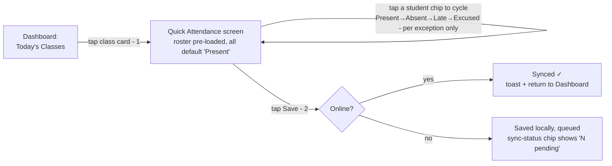
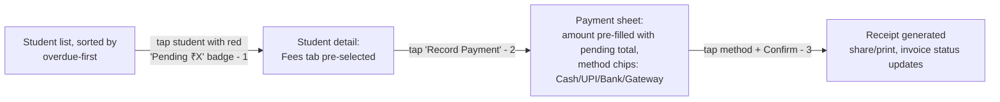

# 8. UI/UX Flows & Screen Inventory

Scope: full screen inventory per role, detailed flows for the two named critical paths (Quick Attendance, Fee Collection), secondary critical flows, and a systematic empty/loading/error state inventory. This is the reference Phase 4 implementation builds against — a screen not listed here shouldn't get built without coming back to add it here first, so the ≤3-tap and no-dead-end principles (docs/01 §1.6) stay enforced by design, not by luck.

## 8.1 Navigation shells

Bottom navigation, 4–5 tabs max per role (more than that and the "fast, minimal" requirement from spec §22 is already lost). A persistent small **sync-status chip** (docs/05 §5.4) sits in the app bar on every shell, not just one screen.

| Role | Tabs (in order) |
|---|---|
| **Teacher** | Dashboard · Classes · Students · Fees · More (Notes, Assignments, Reports, Settings) |
| **Student** | Dashboard · Classes · Assignments · Notes · Profile |
| **Parent** | Dashboard · Child switcher (if >1 child) · Fees · Announcements · Profile |
| **Institute Admin** | Dashboard · Teachers · Students · Reports · Settings |

"More" on the Teacher shell exists because Notes/Assignments/Reports/Settings are real but lower-frequency than the first four — burying them one tap deeper keeps the primary bar from exceeding 5 items rather than cutting a feature.

## 8.2 Screen inventory per role

### Teacher

| Screen | Purpose | Reached from |
|---|---|---|
| Dashboard | Today's classes, attendance summary, pending fees, upcoming classes, pending assignments, recent notifications (spec §12) | Tab bar (default landing) |
| Class list | All owned classes/batches, filter active/completed | Tab bar |
| Class detail | Schedule, roster, attendance history, materials, conflicts | Class list, Dashboard "today's classes" |
| Create/edit class | Name, subject, schedule (recurrence), mode, capacity | Class list FAB |
| Quick attendance | Roster + one-tap status per student for today's occurrence | Dashboard "today's classes", Class detail |
| Attendance history | Calendar/list view, per-student % | Class detail, Student detail |
| Edit attendance record | Change a past mark, requires reason (audit-logged) | Attendance history (long-press/edit icon) |
| Student list | Search/filter (active/inactive, class, payment status) | Tab bar |
| Student detail | Profile, guardians, attendance, fees, notes, assignments, performance, communication history — one screen, tabbed sections | Student list, Class roster |
| Add/invite student | Manual form / generate invite link-code / import CSV | Student list FAB |
| Merge students | Pick surviving record, review conflicts | Student detail overflow menu (flagged duplicates only) |
| Fee dashboard | Pending/overdue list, this month's revenue | Tab bar |
| Record payment | Amount, method, note → receipt | Fee dashboard, Student detail "Fees" tab |
| Generate invoices | Batch-generate for a billing period | Fee dashboard |
| Invoice detail | Line items, payment history, credit notes | Fee dashboard, Student detail |
| Notes/materials library | Folders, search, upload | More → Notes |
| Upload note | File picker, share-to (student/class/institute), expiry | Notes library FAB |
| Assignments list | By class, status (open/closed) | More → Assignments |
| Create assignment | Title, attachments, deadline, target | Assignments list FAB |
| Review submissions | Per-student submission, feedback, grade | Assignment detail |
| Reports | Attendance/fee/student report builder, export | More → Reports |
| Calendar | Unified own-classes/assignment-due view for a date range, with schedule-conflict flags (docs/03 §3.5) | Dashboard quick action |
| Notification center | List, mark read, deep link to source | App bar bell icon |
| Notification preferences | Per-category channel toggle | Settings |
| Verification request | Submit qualification docs | Profile → Verification status |
| Settings/profile edit | Profile fields, language, logout, log-out-other-devices | More → Settings |

### Student

| Screen | Purpose | Reached from |
|---|---|---|
| Dashboard | Today's classes, upcoming assignments, attendance %, fee status (spec §12) | Tab bar |
| Class list / detail | Schedule, materials, teacher info | Tab bar |
| My attendance | History + percentage, low-attendance warning banner if applicable | Dashboard, Class detail |
| Assignments list | Open/submitted/reviewed, deadline countdown | Tab bar |
| Assignment detail / submit | Description, attachments, submit/resubmit, feedback once reviewed | Assignments list |
| Notes library | Browse/download shared materials | Tab bar |
| Fee status | Pending/paid history (read-only) | Dashboard |
| Announcements | From teachers/institute | Notification center |
| QR check-in | Scan teacher's session QR | Dashboard "today's classes" quick action |
| Calendar | Unified enrolled-classes/assignment-due/fee-due view for a date range | Dashboard quick action |
| Profile/settings | Own profile, language, notification prefs | Tab bar |

### Parent

| Screen | Purpose | Reached from |
|---|---|---|
| Dashboard | Selected child's attendance, fee status, upcoming classes, announcements, performance (spec §12) | Tab bar |
| Child switcher | Pick which linked child, if multiple | App bar (visible only if >1 child) |
| Child attendance detail | History, %, absence pattern | Dashboard |
| Fees | Pending/paid, pay-online action (if gateway enabled), receipts | Tab bar |
| Announcements | From child's teachers/institute | Tab bar |
| Performance | Metric history for the child | Dashboard |
| Calendar | Unified view across every linked child's classes/assignments/fees due for a date range | Dashboard quick action |
| Request absence / raise query | Structured request to teacher (never a direct edit, docs/06 §6.3) | Child attendance detail |
| Notification preferences | Per-category channel + digest frequency | Profile |
| Profile/settings | Own profile, linked-children management | Tab bar |

### Institute Admin

| Screen | Purpose | Reached from |
|---|---|---|
| Dashboard | Institute-wide attendance/fee/teacher summary | Tab bar |
| Teachers list / detail | Roster, invite, verification status, payout config | Tab bar |
| Branches | Manage branches (multi-branch institutes) | Settings |
| Students list / detail | Institute-wide view, same detail screen as teacher's (permission-gated fields) | Tab bar |
| Reports | Institute-scope attendance/fee/revenue reports | Tab bar |
| Announcements | Institute-wide broadcast | Dashboard quick action |
| Calendar | Institute-wide class schedule for a date range, with conflict flags | Dashboard quick action |
| Revenue/payouts | Teacher revenue-split summary | Reports |
| Settings | Institute profile, admin-attendance-override toggle (docs/06 §6.3), subscription | Tab bar |

### Admin Web Panel (super_admin)

| Screen | Purpose |
|---|---|
| Users | Search/suspend/role-manage across the platform |
| Institutes | List, drill into any institute's admin view |
| Teacher categories | Add/edit categories + default templates — the "no code change" mechanism (docs/01 §1.1) |
| Verification queue | Review submitted docs, approve/reject with reason |
| Reported content | Moderation queue for flagged notes/announcements |
| System config | Feature flags, rate-limit tuning, subscription plans |
| Audit log viewer | Filter by actor/entity/date |

## 8.3 Critical flow — Quick Attendance (target: ≤3 taps to save)



Design decisions that make this hold at 2 taps for the common case (a fully-present class):
- Roster **defaults every student to Present** on load — a teacher with a fully-attended class taps the class card, taps Save, done. Only exceptions require a tap.
- The screen **is** the roster — no intermediate "select date" step for today's occurrence (date defaults to today; past/future dates are a secondary "change date" affordance, not the default path).
- Save is optimistic and works offline (docs/05 §5.4) — no network-wait between tap and confirmation.
- Bulk actions ("mark all absent" for a cancelled-but-not-yet-flagged class) live as a single overflow action, not a separate screen.

## 8.4 Critical flow — Fee Collection (target: ≤3 taps to record a payment)



Design decisions:
- Student list **sorts overdue-first by default** in the Fees context so the teacher doesn't have to search for who owes money.
- The payment amount field is **pre-filled with the exact pending amount** (partial/overpayment are edits to that field, not extra steps for the common full-payment case).
- Method selection is single-tap chips, not a dropdown.
- Receipt is auto-generated and offered for share (WhatsApp/SMS/email) immediately — closing the loop in the same screen rather than a separate "receipts" hunt.

## 8.5 Secondary critical flows

- **Teacher onboarding**: category grid (spec §2) → profile form (progressive, not one giant form — split into Basics / Teaching details / Fees & availability, each save-as-you-go) → verification doc upload (optional, skippable, revisitable from Settings) → land on empty-state Dashboard with a "create your first class" CTA.
- **Student invite**: teacher taps "Invite" → choose link or code → share sheet (native OS share). Student opens link → lands on a pre-filled registration screen (class/teacher already attached) → on submit, enters `enrollments` as `pending` until teacher confirms (guards against link being shared to the wrong person) — teacher gets one confirm/reject tap in a "New requests" dashboard card.
- **Class creation with conflict detection**: as the teacher picks days/time, a **live inline warning** appears ("Overlaps with 'Guitar Batch B', Tue 5–6pm") computed against docs/03 §3.5 logic — non-blocking, shown before Save is even tapped, not as a rejection after submission.
- **Assignment lifecycle**: Teacher creates (target + deadline) → Student gets a notification + Assignments-tab badge → submits (camera/file picker, resumable upload per docs/02 §2.6) → Teacher reviews inline (swipe between students' submissions in one review screen, not one screen per student) → Student gets notified with feedback/grade. A missed-deadline submission is visually flagged "Late" but not blocked, unless the assignment explicitly disallows late submission.
- **Notification → deep link**: every push notification opens directly to the relevant record (a specific invoice, a specific attendance session) through the same RBAC-guarded route as in-app navigation (docs/05 §5.3) — never a generic "open app to dashboard."
- **Offline → sync**: chip shows `● Synced` (green) / `↻ Syncing…` / `N pending` (amber) / `⚠ N conflicts` (red, tappable → conflict resolution list, docs/05 §5.4). Never a blocking spinner over the whole screen for background sync.

## 8.6 Empty / loading / error state inventory

Every list/detail screen in §8.2 needs all three; the table below gives the pattern once so it's applied consistently rather than reinvented per screen.

| State | Pattern | Example |
|---|---|---|
| **Empty — first use** | Illustration + one-line explanation + single primary CTA | Class list, no classes yet: *"No classes yet — create your first class to start taking attendance."* [+ Create Class] |
| **Empty — filtered to nothing** | Lighter treatment, no illustration, offer to clear filters | Student list filtered to "Overdue" with none: *"No overdue payments right now."* |
| **Loading — first load** | Skeleton screens matching the eventual layout (not a spinner) for list/detail screens; a small inline spinner only for button-triggered actions | Student detail skeleton shows placeholder rows for each tab section while data loads |
| **Loading — background refresh** | No skeleton (stale local data is already showing per docs/05 §5.4) — just the sync-status chip ticks to "Syncing" | Dashboard pull-to-refresh |
| **Error — network** | Inline banner, not a full-screen takeover if cached data exists; "Retry" action | *"Couldn't refresh — showing saved data. [Retry]"* |
| **Error — network, no cached data** | Full-screen state, retry CTA | First-ever login with no connectivity |
| **Error — validation** | Inline, field-level, on blur and on submit attempt — never a generic toast for a form error | Payment amount field: *"Amount can't exceed ₹X credit limit"* (only if such a rule exists) |
| **Error — permission denied** | Distinct from network error; explains *why*, not just "something went wrong" | Parent attempting an action only teachers can do (shouldn't be reachable per docs/05 §5.3, but the API-level denial still needs a clear message as defense in depth) |
| **Confirmation — destructive/critical** | Modal dialog, explicit consequence stated, default button is the *safe* action | Archiving a student: *"Archive Rahul Sharma? Attendance and fee history is kept — you can restore this student later. [Cancel] [Archive]"* |

## 8.7 Dashboard layout regions (wireframe-level)

Textual region maps — actual pixel-level mockups are a Figma/design-tool exercise once these are validated, not something to lock in prose. Each dashboard uses the same vertical rhythm: **status/alert zone → primary action zone → summary cards → recent activity**, so switching between roles (a user with multiple roles, docs/06 §6.1) stays visually familiar.

```
┌─────────────────────────────────────┐
│ App bar: greeting, sync chip, bell    │
├─────────────────────────────────────┤
│ Alert zone (conditional, collapses    │  ← low attendance, overdue fee,
│ to nothing if no alerts)               │    pending verification, etc.
├─────────────────────────────────────┤
│ "Today" card — today's classes list,  │  ← tap → Quick Attendance (§8.3)
│ each row tappable                      │
├─────────────────────────────────────┤
│ Summary tiles (2x2 grid):              │  ← role-specific metrics,
│ [Total Students] [Pending Fees]        │    see spec §12 per-role list
│ [Attendance %]    [Pending Assignments]│
├─────────────────────────────────────┤
│ Recent activity / notifications feed  │  ← last 5, "see all" → notif center
├─────────────────────────────────────┤
│ Bottom nav (§8.1)                      │
└─────────────────────────────────────┘
```

Tapping any summary tile navigates to that tile's full list screen (e.g. "Pending Fees" tile → Fee dashboard, sorted overdue-first per §8.4) — dashboards are a *navigation surface*, not a dead-end report.
